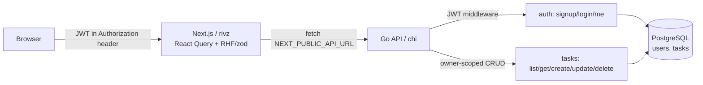

# Plan: Task Management Application (Full-Stack Assessment)

## Context

`rivz-asn` currently contains only a bare `create-next-app` scaffold under `rivz/`
(Next.js 16, React 19, Tailwind v4, App Router, pnpm). The goal is to deliver the
**Rival.io full-stack take-home**: a task-management app with a Go REST API, a
PostgreSQL database, and the existing Next.js frontend, covering all five required
tasks plus four selected bonuses (**Dockerized setup, CI pipeline, dark mode,
optimistic UI**). Deployment target: **frontend on Vercel, Go backend + Postgres on
Railway**.

The deliverable must be a working repo with README setup instructions, `.env.example`,
≥3 meaningful tests, clean commit history, and a deployed live link.

## Architecture

```
rivz-asn/                         (monorepo root)
├── rivz/            ── Next.js 16 frontend (App Router, TS, Tailwind v4)
├── backend/         ── Go REST API (chi, pgx, JWT)
├── docker-compose.yml ── db + backend + frontend, one-command local run
├── .env.example     ── all env vars for both services
├── README.md        ── setup, run, deploy, assumptions/trade-offs
└── .github/workflows/ci.yml ── run backend + frontend tests on push
```



**Auth model:** JWT (HS256). Token stored in `localStorage` on the frontend and sent
via `Authorization: Bearer` header (chosen over cookies because frontend and backend
live on different domains in production — avoids SameSite/CORS-credentials friction
while still surviving page refresh). Backend enforces per-user ownership on every task
route; CORS allows the configured frontend origin.

---

## Backend (`backend/`) — Go 1.24

**Stack (all mainstream, low-friction):** `chi/v5` (router + middleware), `jackc/pgx/v5`

- `pgxpool` (Postgres), `golang-migrate` with `//go:embed` iofs source (no external CLI
  needed, runs migrations on startup), `golang-jwt/jwt/v5`, `golang.org/x/crypto/bcrypt`,
  `go-playground/validator/v10`, `stretchr/testify` for tests.

**Layout (idiomatic, package-by-feature):**

```
backend/
  cmd/api/main.go            # load config, connect pool, run migrations, start server
  internal/config/           # env loading (DATABASE_URL, JWT_SECRET, PORT, CORS_ORIGIN)
  internal/db/               # pgxpool init + migrate runner
  internal/migrations/       # 0001_init.up.sql / .down.sql (embedded)
  internal/httputil/         # JSON write helpers, consistent error envelope, validator
  internal/auth/             # model, repository, service, handlers, jwt, middleware
  internal/tasks/            # model, repository, service, handlers
  internal/server/           # chi router, CORS, middleware wiring, route registration
  go.mod  Dockerfile
```

**Schema (`0001_init`):** Postgres enum types give clean priority/status sorting.

```sql
CREATE TYPE task_status   AS ENUM ('todo','in_progress','done');
CREATE TYPE task_priority AS ENUM ('low','medium','high'); -- enum order = sort order
CREATE TABLE users (
  id UUID PRIMARY KEY DEFAULT gen_random_uuid(),
  email TEXT UNIQUE NOT NULL, password_hash TEXT NOT NULL,
  created_at TIMESTAMPTZ NOT NULL DEFAULT now());
CREATE TABLE tasks (
  id UUID PRIMARY KEY DEFAULT gen_random_uuid(),
  user_id UUID NOT NULL REFERENCES users(id) ON DELETE CASCADE,
  title TEXT NOT NULL, description TEXT NOT NULL DEFAULT '',
  status task_status NOT NULL DEFAULT 'todo',
  priority task_priority NOT NULL DEFAULT 'medium',
  due_date TIMESTAMPTZ,
  created_at TIMESTAMPTZ NOT NULL DEFAULT now(),
  updated_at TIMESTAMPTZ NOT NULL DEFAULT now());
CREATE INDEX idx_tasks_user ON tasks(user_id);
```

**Endpoints:**
| Method | Path | Notes |
|---|---|---|
| POST | `/auth/signup` | email + password; bcrypt hash; returns JWT + user |
| POST | `/auth/login` | verify bcrypt; returns JWT + user |
| GET | `/auth/me` | JWT-protected; restores session on FE reload |
| POST | `/tasks` | validated create (title required, status/priority enum, due_date optional) |
| GET | `/tasks` | `?status=&search=&sort=due_date\|priority\|created_at&order=asc\|desc&page=&limit=` — filter + search + sort compose in one SQL query (`WHERE user_id=$ AND (status=$) AND (title ILIKE $)` + dynamic `ORDER BY` from a whitelist + `LIMIT/OFFSET`); returns `{ data, page, limit, total }` |
| GET | `/tasks/:id` | owner-scoped (404 if not owner) |
| PATCH | `/tasks/:id` | partial update, validated, owner-scoped, bumps `updated_at` |
| DELETE | `/tasks/:id` | owner-scoped |

**Cross-cutting:** all `/tasks` and `/auth/me` behind JWT middleware that parses the
bearer token and puts `userID` in the request context. Consistent error envelope
`{ "error": { "message": string, "fields"?: {field: msg} } }`. Status codes: 400
validation, 401 missing/invalid token, 404 not-found-or-not-owner, 409 duplicate email,
201 create, 204 delete, 200 otherwise. Sort whitelist prevents SQL injection on
`ORDER BY`.

**Tests (≥3 meaningful, Go `testing` + testify):** run against a real Postgres
(testcontainers-go, or a `TEST_DATABASE_URL` pointing at the compose/CI Postgres).

1. Signup→login flow: password is hashed (not stored plaintext), bad password rejected.
2. Ownership: user B gets 404 fetching/updating/deleting user A's task.
3. List query: status filter + title search + sort-by-priority/due_date + pagination
   return the expected ordered subset.
4. Validation: create with empty title / invalid enum / bad due_date → 400 with field errors.

---

## Frontend (`rivz/`) — Next.js 16 App Router

> **Before writing FE code:** run `pnpm install` (node_modules absent), then heed
> `rivz/AGENTS.md` — read `node_modules/next/dist/docs/` for any Next 16 API that
> differs from training data (routing, route handlers, metadata).

**Added deps:** `@tanstack/react-query`, `react-hook-form` + `zod` +
`@hookform/resolvers`, `next-themes`, and `shadcn/ui` primitives (button, input, select,
dialog, table, skeleton, sonner toast) for polished, responsive, accessible UI on
Tailwind v4.

**Structure:**

```
rivz/app/
  providers.tsx              # client: QueryClientProvider + ThemeProvider + AuthProvider
  layout.tsx                 # wrap children in <Providers>; add suppressHydrationWarning
  (auth)/login/page.tsx      # RHF + zod form
  (auth)/signup/page.tsx
  (app)/layout.tsx           # client guard: redirect to /login if no token; top nav + theme toggle
  (app)/tasks/page.tsx       # list: filter + search + sort controls + pagination + table/cards
  (app)/tasks/_components/   # TaskForm (dialog, create+edit), TaskRow, Filters, Pagination
lib/
  api.ts                     # fetch wrapper: base = NEXT_PUBLIC_API_URL, inject bearer, throw typed errors, handle 401→logout
  auth-context.tsx           # user/token state, login/logout/signup, restore from localStorage on mount, /auth/me validation
  tasks-hooks.ts             # useTasks, useTask, useCreateTask, useUpdateTask, useDeleteTask, useToggleComplete (React Query)
  schemas.ts                 # zod schemas shared by forms
```

**Behavior mapping to requirements:**

- **List view** (`tasks/page.tsx`): status filter (`Select`), title search (debounced
  input), sort dropdown (due date / priority / created) + direction, pagination controls
  — all stored in URL search params and fed to `useTasks`, so they compose server-side.
- **Create/edit form:** shadcn `Dialog` + RHF + zod client-side validation (mirrors
  backend rules); same component for create and edit.
- **Complete + delete from UI:** checkbox toggles status→`done`; delete button. Both use
  **optimistic updates** (React Query `onMutate` cancels queries, snapshots cache, applies
  change immediately; `onError` rolls back; `onSettled` invalidates) — satisfies the
  optimistic-UI bonus.
- **States:** `isLoading`→skeletons, empty list→empty-state card, error→toast + retry.
- **Responsive:** desktop table, mobile stacked cards via Tailwind breakpoints.
- **Auth persistence:** token in localStorage, `AuthProvider` rehydrates on mount and
  validates via `/auth/me`; refresh keeps the user logged in.

**Dark mode (bonus):** `next-themes` ThemeProvider (`attribute="class"`), convert
`rivz/app/globals.css` from `@media (prefers-color-scheme: dark)` to a class-based
`.dark` variant block, add a header theme-toggle button; preference persists via
next-themes localStorage.

---

## Docker, CI, Deployment (bonuses + deliverables)

- **`backend/Dockerfile`:** multi-stage (build static binary on `golang:1.24`, run on
  `gcr.io/distroless` or `alpine`).
- **`rivz/Dockerfile`:** multi-stage Next.js with `output: 'standalone'` in
  `next.config.ts`.
- **`docker-compose.yml`** (root): `db` (`postgres:16` + healthcheck + volume), `backend`
  (depends_on db healthy, runs embedded migrations on start), `frontend`
  (`NEXT_PUBLIC_API_URL` → backend). One command: `docker compose up`.
- **`.github/workflows/ci.yml`:** two jobs — _backend_ (`postgres` service container →
  `go vet` + `go test ./...`), _frontend_ (`pnpm install` + `pnpm lint` + `pnpm build`).
- **`.env.example`** (root): `DATABASE_URL`, `JWT_SECRET`, `PORT`, `CORS_ORIGIN`,
  `NEXT_PUBLIC_API_URL`.
- **`README.md`:** prerequisites, `docker compose up` quickstart, manual run (backend
  `go run ./cmd/api`, frontend `pnpm dev`), env var table, test commands, API reference,
  **Vercel + Railway** deploy steps (Railway: Postgres add-on + backend service with
  `DATABASE_URL`/`JWT_SECRET`/`CORS_ORIGIN`; Vercel: import `rivz/`, set
  `NEXT_PUBLIC_API_URL` to the Railway URL), and assumptions/trade-offs.

---

## Implementation order

1. **Backend scaffold** — `go mod init`, layout, config, pgxpool, embedded migrations,
   server/router with CORS + health check.
2. **Auth** — user repo, bcrypt, JWT issue/verify, signup/login/me handlers, middleware.
3. **Tasks** — model, repo (composed filter/search/sort/paginate SQL), service,
   validated handlers, owner scoping, error envelope.
4. **Backend tests** — the 4 above; wire into CI.
5. **Frontend foundation** — `pnpm install`, add deps, init shadcn, `providers.tsx`,
   `lib/api.ts`, `auth-context.tsx`, `(app)/layout.tsx` guard.
6. **Auth pages** — login + signup.
7. **Tasks UI** — list (filters/search/sort/pagination), TaskForm dialog, toggle/delete
   with optimistic updates, loading/empty/error states, responsive layout.
8. **Dark mode** — globals.css class variant + theme toggle.
9. **Docker** — both Dockerfiles + docker-compose; verify one-command boot.
10. **CI + README + `.env.example`** — finalize, document deploy.
11. Clean, scoped commits throughout (one per phase/feature).

Work happens on branch `claude/plan-refine-34lo1e`. Open a PR when complete (no
deployment performed by me — README documents the Vercel + Railway steps).

---

## Verification

- **Backend:** `cd backend && go vet ./... && go test ./...` (all pass, incl. ownership
  - validation + filter/sort tests). Smoke test with `curl`: signup → capture token →
    `POST /tasks` → `GET /tasks?status=todo&search=foo&sort=priority&order=desc&page=1&limit=10`
    → confirm filtering/sort/pagination → confirm another user's token gets 404 on the task.
- **Frontend:** `cd rivz && pnpm lint && pnpm build` succeed. `pnpm dev` → sign up, create
  tasks, filter/search/sort, edit, toggle complete (UI updates instantly, rolls back if
  backend is stopped), delete, refresh page (still logged in), toggle dark mode (persists).
- **Full stack:** `docker compose up` from root brings up db + backend + frontend; app
  works end-to-end at `localhost:3000` against the API. CI green on push.
